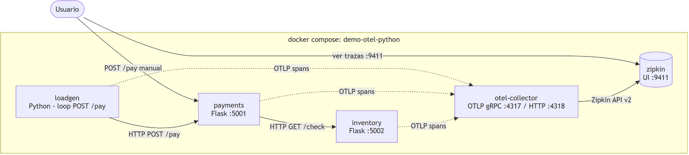

# demo_otel_python

Demo simple de **trazabilidad distribuida con OpenTelemetry en Python/Flask**, levantada con un solo `docker compose up`.

`loadgen` genera pagos contra `payments`, que valida stock llamando a `inventory`. Los tres servicios exportan sus trazas por OTLP gRPC al **OpenTelemetry Collector**, que las reenvía a **Zipkin** para visualizarlas.



> El PNG incluye el diagrama embebido: ábrelo con [draw.io](https://app.diagrams.net) para editarlo. Fuente: [docs/architecture.drawio](docs/architecture.drawio).

## Componentes

| Servicio | Tecnología | Puerto | Rol |
|---|---|---|---|
| `loadgen` | Python + requests | — | Generador de carga: `POST /pay` cada 1-3 s |
| `payments` | Python + Flask | `5001` | API de pagos; llama a `inventory` |
| `inventory` | Python + Flask | `5002` | Consulta de stock (~10% errores, ~20% sin stock) |
| `otel-collector` | OpenTelemetry Collector | `4317` / `4318` | Recibe OTLP (gRPC/HTTP) y exporta a Zipkin |
| `zipkin` | OpenZipkin | `9411` | Backend y UI de trazas |

Detalle de conexiones y flujo de spans: [docs/architecture.md](docs/architecture.md).

## Levantar la demo en GitHub Codespaces

1. Abre el repo en un Codespace: **Code → Codespaces → Create codespace on main**.
2. En la terminal del Codespace:

   ```bash
   ./start.sh
   ```

   o manualmente:

   ```bash
   docker compose up --build -d
   ```

3. **Acceso a Zipkin (ver tus trazas):**
   - `start.sh` imprime la URL directa: `https://<codespace>-9411.app.github.dev`
   - O ve a la pestaña **PORTS** de VS Code → puerto **9411 (Zipkin UI)** → clic en el icono del globo 🌐.
   - En la UI de Zipkin pulsa **RUN QUERY** para ver las trazas `loadgen → payments → inventory`.

4. **Generar un pago manual** (además del loadgen):

   ```bash
   curl -X POST http://localhost:5001/pay?product=book
   ```

5. **Ver logs:**

   ```bash
   docker compose logs -f loadgen          # pagos generados
   docker compose logs -f otel-collector   # spans recibidos/exportados
   ```

6. **Apagar:**

   ```bash
   docker compose down
   ```

## Levantar la demo en local

Requisito: Docker Desktop.

```bash
docker compose up --build -d
# Zipkin UI: http://localhost:9411
# Payments:  http://localhost:5001
```

## Estructura

```
.
├── docker-compose.yml          # Orquestación de los 5 servicios
├── otel-collector-config.yaml  # Pipeline OTLP -> Zipkin
├── start.sh                    # Levanta todo e imprime las URLs de acceso
├── .devcontainer/
│   └── devcontainer.json       # Codespaces: docker-in-docker + puertos
├── payments/                   # Flask :5001 (app.py, Dockerfile, requirements.txt)
├── inventory/                  # Flask :5002 (app.py, Dockerfile, requirements.txt)
├── loadgen/                    # Generador de carga (app.py, Dockerfile, requirements.txt)
└── docs/
    ├── architecture.md         # Diagrama de conexiones y detalle
    ├── architecture.drawio     # Fuente editable del diagrama
    ├── architecture.png        # Imagen de arquitectura
    └── architecture.mmd        # Fuente Mermaid
```

## Cómo funciona la instrumentación

Cada servicio Python crea un `TracerProvider` con `BatchSpanProcessor` + `OTLPSpanExporter` apuntando a `http://otel-collector:4317` (variable `OTEL_EXPORTER_OTLP_ENDPOINT`). La auto-instrumentación de Flask y requests (`FlaskInstrumentor`, `RequestsInstrumentor`) genera los spans HTTP y **propaga el contexto** (header `traceparent`), por eso en Zipkin cada pago aparece como una sola traza distribuida con spans de los tres servicios.
